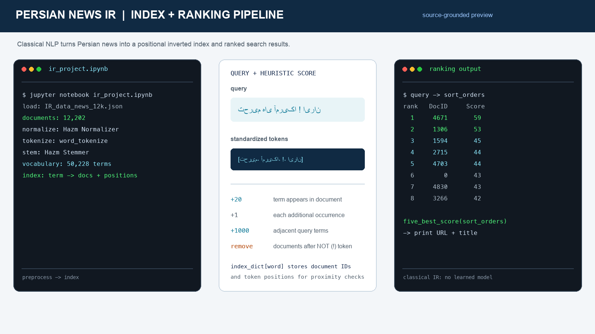
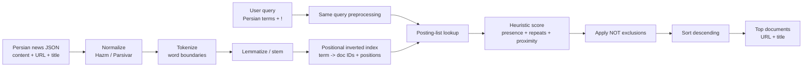

# Persian News Search - Classical NLP and Information Retrieval



An educational information-retrieval project for searching Persian news with classical natural-language processing. The project normalizes and tokenizes Persian text, experiments with lemmatization and stemming, builds a positional inverted index, and ranks documents with term-presence, repetition, adjacency, and NOT-query rules.

## Recommended project identity

**Recommended repository name:** `persian-news-information-retrieval`

**GitHub About description:**

> Classical Persian news search using Hazm/Parsivar NLP preprocessing, positional inverted indexing, proximity-aware heuristic scoring, and ranked document retrieval.

## Retrieval method

This project applies **classical NLP and information retrieval** to Persian news. The implementation uses computational-linguistics tools and symbolic ranking:

- Hazm and Parsivar for Persian normalization, tokenization, lemmatization, and stemming.
- An inverted index that maps terms to matching document IDs and token positions.
- A hand-designed relevance score based on document presence, repeated occurrences, and adjacent query terms.
- A `!` query operator that removes documents containing the following term.

The current ranking is deliberately inspectable and provides a clear baseline for later BM25, learning-to-rank, or dense-retrieval experiments.

## What the project demonstrates

- Persian text preprocessing with two library paths: Hazm and Parsivar.
- A positional inverted index with document membership and occurrence locations.
- Query normalization and token-level retrieval.
- Heuristic relevance scoring and ranked result lists.
- Proximity-aware matching for adjacent query terms.
- Boolean-style NOT filtering using `!`.
- Returning top-ranked document URLs and titles from a news corpus.
- Notebook-based experimentation with inspectable intermediate outputs.

## Retrieval architecture



The core data structure is an inverted index. Each indexed term stores a document list and the token positions at which it occurs, enabling both fast candidate lookup and adjacency checks.

## Preprocessing pipeline

The notebooks and scripts explore the following sequence:

1. Load news records from JSON.
2. Normalize Persian text to reduce formatting variation.
3. Tokenize each article into words and punctuation.
4. Apply lemmatization and/or stemming.
5. Optionally remove very common or punctuation-like tokens.
6. Build the positional inverted index.
7. Apply the same normalization steps to a query.
8. Retrieve candidate documents, score them, remove NOT matches, and sort results.

The notebook output records `12,202` documents and an index size of `50,228` terms for its original corpus. Those figures are useful reference points for the experiment, but the corpus itself is not tracked in this repository.

## Scoring model

The current implementation uses transparent, hand-written scoring rather than a learned model.

| Signal | Contribution | Meaning |
| --- | ---: | --- |
| Term appears in a document | `+20` | Rewards document membership in a posting list |
| Additional occurrence | `+1` each | Rewards repeated mentions of a query term |
| Adjacent query terms | `+1000` | Strongly rewards neighboring positions in the Parsivar variant |
| `! term` exclusion | remove | Removes documents containing the term after `!` |

For example, a query shaped like `تحریم های آمریکا ! ایران` retrieves documents matching the positive terms and removes documents containing the excluded term. The scoring constants are intentionally easy to inspect and modify.

## Project files

```text
.
├── ir_project.ipynb          # Main Hazm notebook and experiment log
├── P1.py                     # Compact Hazm script with a sample query
├── ir_project_parsivar.py    # Parsivar-oriented notebook export
└── docs/
    └── persian-news-ir-runtime-preview.png
```

The scripts expect news JSON files that are not currently committed:

- `ir_project.ipynb` and `ir_project_parsivar.py` expect `IR_data_news_12k.json`.
- `P1.py` expects `documents.json`.

Each record is expected to contain at least `content`; the result-display code also expects `url` and `title`. A compatible shape is:

```json
{
  "0": {
    "content": "متن خبر ...",
    "url": "https://example.org/news/0",
    "title": "عنوان خبر"
  }
}
```

## Run the experiments

### Requirements

- Python 3.8+.
- A compatible Persian news JSON corpus.
- Hazm for `P1.py` and the main notebook.
- Parsivar for the Parsivar experiment.
- Jupyter for running the notebook interactively.

Install the unpinned research dependencies in an isolated environment:

```bash
python3 -m venv .venv
source .venv/bin/activate
python -m pip install --upgrade pip
python -m pip install hazm parsivar jupyter
```

### Main notebook

Place `IR_data_news_12k.json` beside the notebook, update the data path if necessary, and run:

```bash
jupyter notebook ir_project.ipynb
```

The notebook is also prepared for a Google Colab/Drive workflow. Its path-mount cell should be adapted to the user’s own Drive location before execution.

### Compact Hazm script

Place `documents.json` in the repository root and run:

```bash
python P1.py
```

`P1.py` builds the index, evaluates the sample query `فوتسال AFC ! فوتبال`, and prints ranked document IDs and scores.

### Parsivar script status

`ir_project_parsivar.py` is an exported notebook-style experiment rather than a clean standalone module. It contains a useful Parsivar preprocessing direction, but it currently depends on notebook context and needs cleanup before direct execution: it calls `get_ipython()`, references `word_tokenize` instead of the configured tokenizer object, and uses an undefined `lemmatizer` in `standarding_query()`. These are documented limitations of the current source, not hidden behind the project description.

## Inspectable outputs

The stored notebook output demonstrates the intended workflow:

- Persian articles are normalized and tokenized.
- Stemming changes forms such as `فوتسال` and other news terms into indexable representations.
- The term index stores document IDs and token positions.
- A ranked list is printed with columns for rank, document ID, and score.
- `five_best_score()` resolves the top results to their URL and title.

## Software engineering and research strengths

The project is especially useful as an interpretable search-engine baseline:

- The index representation is explicit and easy to inspect.
- Relevance behavior is controlled by named scoring constants rather than opaque model weights.
- Token positions make proximity behavior testable.
- The notebook records intermediate stages, which is valuable for debugging Persian normalization and morphology.
- The same idea is explored with both Hazm and Parsivar, making preprocessing tradeoffs visible.

## Limitations and next steps

The current repository is an educational experiment, not a production search service. The highest-value improvements would be:

- Add the dataset location, download instructions, or a small redistributable sample corpus.
- Add `requirements.txt` or `pyproject.toml` with pinned, compatible versions.
- Refactor preprocessing, indexing, query parsing, scoring, and result formatting into testable modules.
- Replace broad `except` blocks and unchecked dictionary access with explicit error handling.
- Handle unknown query terms without raising `KeyError`.
- Normalize Persian zero-width non-joiners, punctuation, digits, and Unicode variants consistently.
- Separate stopword removal from indexing and ensure the filtered index is actually used.
- Add phrase and proximity operators with a formal query parser.
- Establish labeled queries and evaluate Precision@k, Recall@k, MAP, and NDCG.
- Add TF-IDF or BM25 as a stronger lexical-ranking baseline.
- Compare the lexical baseline with a future embedding or transformer reranker, clearly measuring whether it improves retrieval quality.
- Add caching or a serialized index so searches do not rebuild the corpus every run.

## Verification

Both Python source files compile syntactically with:

```bash
python3 -m py_compile P1.py ir_project_parsivar.py
```

The full search pipeline was not executed in this environment because Hazm/Parsivar and the referenced JSON datasets are not installed or present in the cloned repository. The preview image is based on the project’s stored notebook outputs and actual preprocessing, indexing, and scoring logic.
